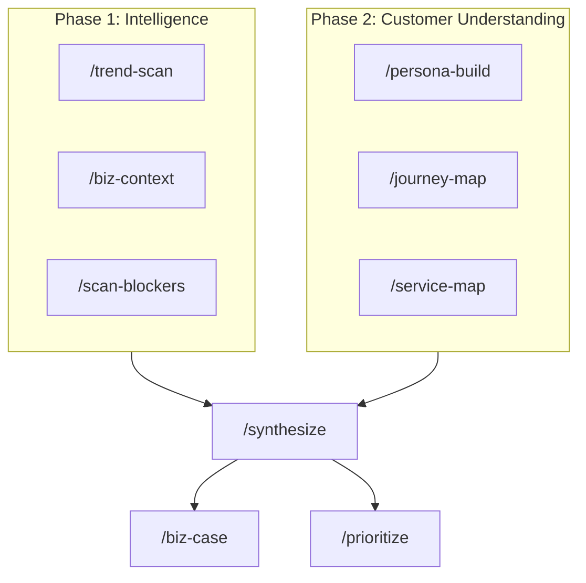
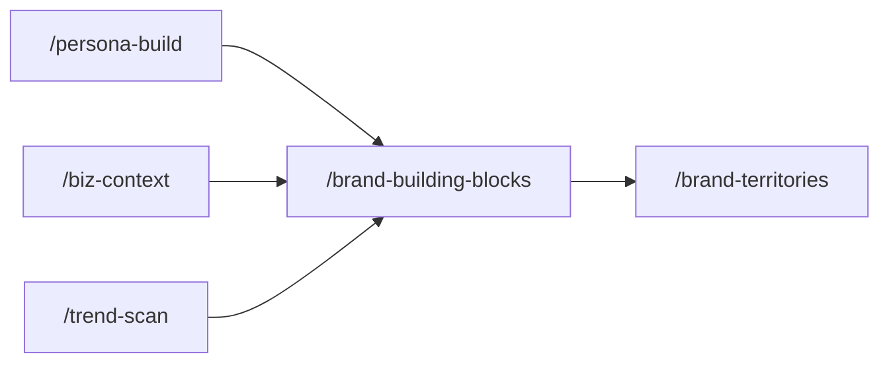

# KStack

**A set of Claude Code slash-command skills for CX transformation, brand strategy, and innovation work.**

KStack gives you 11 expert cognitive modes — the way a senior service designer, brand strategist, organizational consultant, or workshop facilitator actually thinks — as slash commands inside Claude Code. Instead of prompting a generic AI assistant, you invoke a specific expert perspective with a structured methodology, opinionated outputs, and the right questions at the right moments.

Built for CX consultants, service designers, brand strategists, innovation leads, and anyone who runs CX transformation or brand development programs.

---

## What it does

Most AI tools give you a chatbot. KStack gives you a workflow.

Each skill encodes a real methodology: how an expert would actually approach the problem, what they'd look for, what questions they'd ask, and what a finished output looks like. Skills are designed to chain — the output of one becomes the input of the next.



**Brand Strategy Track** — chains with the CX workflow:



---

## The 11 skills

### CX Transformation

| Skill | Expert mode | What you get |
|---|---|---|
| `/trend-scan` | Futurist + macro analyst | Trend radar across PESTLE + tech waves, scored for CX relevance, with specific CX implications and convergence zones |
| `/biz-context` | Management consultant | Five-domain business diagnostic (revenue, customer metrics, ops, market position, org capability) + key tensions + strategic "so what" |
| `/scan-blockers` | Organizational consultant | Full blocker map across 8 categories, rated by severity and addressability, with "where to start" and landmine warnings |
| `/persona-build` | UX researcher + behavioral psychologist | Rich persona card with JTBD (functional, emotional, social), trigger events, anxieties, unmet needs — every claim tagged as evidenced or inferred |
| `/journey-map` | Service designer | Stage-by-stage journey map with customer thought/feeling/emotion score per touchpoint, moments of truth, and top 5 opportunities |
| `/service-map` | Service designer + operations consultant | 5-layer service blueprint (customer actions → frontstage → backstage → support processes → systems), failure point register, handoff risks |
| `/synthesize` | Senior strategist | Affinity clusters with source attribution, tension map, ranked How Might We questions, burning platform, synthesis headline |
| `/biz-case` | Management consultant + financial analyst | 7-section executive business case (problem, solution, segment, value drivers, ROI, risks, roadmap) — every number tagged as data-backed, benchmarked, or assumption |
| `/prioritize` | Portfolio strategist | Multi-criteria scoring (strategic alignment × customer impact × feasibility × time-to-value), portfolio quadrant view, sequencing recommendation, explicit deprioritization rationale |

### Brand Strategy

| Skill | Expert mode | What you get |
|---|---|---|
| `/brand-building-blocks` | Brand strategist + research synthesizer | 5-8 named building blocks across Audience, Company, and Moment forces — the insight-rich fuel for brand territories |
| `/brand-territories` | Brand strategist + creative director | 3 distinct territory directions, each anchored by a different emotional benefit, with "What if we..." scenarios for each |

---

## Installation

**Requires:** [Claude Code](https://claude.ai/code) (the CLI)

### Option A — Clone and run setup (recommended)

```bash
git clone https://github.com/YOUR_USERNAME/KStack.git
cd KStack
./setup
```

The setup script symlinks all 9 skills into `~/.claude/skills/` so they're available as slash commands in any Claude Code session.

**Then restart Claude Code** — the skills will appear in the slash command menu.

### Option B — Manual install (no git required)

If you don't want to clone the repo, you can install skills one at a time:

1. Open any skill's `SKILL.md` file on GitHub (e.g. `trend-scan/SKILL.md`)
2. Copy the full file contents
3. Open Claude Code and paste the contents into the chat
4. Ask Claude: **"Please install this as a slash command skill"**

Claude will save it to `~/.claude/skills/` and it will be available immediately as a slash command in that session. Repeat for each skill you want.

---

## How to use

### Starting a new CX project

For a new engagement, run Phase 1 first to build the strategic and organizational context:

```
/trend-scan       ← what's happening in the external environment?
/biz-context      ← how is this business actually performing?
/scan-blockers    ← what's blocking CX improvement internally and externally?
```

Each skill will ask you intake questions, then work through its methodology. You can paste documents, upload files, or describe context verbally.

### Understanding the customer

Run Phase 2 to build the customer picture:

```
/persona-build    ← who is this customer really?
/journey-map      ← what does their experience actually feel like?
/service-map      ← what's happening behind the scenes that creates that experience?
```

`/journey-map` is designed to consume the output of `/persona-build` — paste the persona card directly into the journey mapping session.

### Synthesizing and activating

Once you have Phase 1 + Phase 2 outputs, bring them together:

```
/synthesize       ← what does it all mean? what are the opportunities?
```

Then move to activation:

```
/biz-case         ← build a business case for a specific initiative
/prioritize       ← score and sequence a portfolio of initiatives
```

### Chaining outputs

All skill outputs are structured markdown. Paste the output of one skill directly into the next session — the receiving skill will read and work from it.

Example chain:
1. Run `/biz-context` → paste output into `/synthesize`
2. Run `/journey-map` → paste output into `/synthesize`
3. Run `/synthesize` → paste output into `/biz-case` or `/prioritize`

---

## What's inside each skill folder

Some skills include companion reference files that the skill reads automatically during execution:

| File | Used by | Contains |
|---|---|---|
| `scan-blockers/blocker-taxonomy.md` | `/scan-blockers` | 8-category taxonomy of 40+ CX blockers across internal and external dimensions |
| `journey-map/touchpoint-taxonomy.md` | `/journey-map` | Full vocabulary of customer touchpoints organized by channel type |
| `biz-case/value-driver-library.md` | `/biz-case` | 14 CX value drivers with mechanisms, metrics, impact ranges, and key assumptions |

---

## Design principles

**Opinionated methodology, not generic prompting.**
Each skill encodes a specific way of thinking — not just a task description. `/scan-blockers` doesn't just "find problems," it works through a structured taxonomy and rates every blocker on severity and addressability. `/biz-case` doesn't just "write a business case," it marks every value estimate as data-backed, benchmarked, or assumption.

**Evidence discipline.**
Skills are designed to distinguish between what's evidenced and what's inferred. `/persona-build` tags every claim. `/biz-case` marks every number. This is deliberate — the outputs are used in real stakeholder settings where credibility matters.

**Mandatory stops at decision points.**
Each skill pauses at key moments to check its work with you before proceeding. Stage definitions in `/journey-map`, theme clusters in `/synthesize`, scoring in `/prioritize` — the human stays in the loop at the decisions that matter.

**Outputs designed for real work.**
Every output is structured markdown designed to be copy-pasted directly into presentations, Notion pages, Word documents, or the next skill in the chain. Nothing needs reformatting.

---

## Project structure

```
KStack/
├── README.md
├── CLAUDE.md                           ← instructions for Claude Code
├── package.json
├── setup                               ← install script
│
├── trend-scan/
│   └── SKILL.md
├── biz-context/
│   └── SKILL.md
├── scan-blockers/
│   ├── SKILL.md
│   └── blocker-taxonomy.md             ← 8-category blocker taxonomy
├── persona-build/
│   └── SKILL.md
├── journey-map/
│   ├── SKILL.md
│   └── touchpoint-taxonomy.md          ← full touchpoint vocabulary
├── service-map/
│   └── SKILL.md
├── synthesize/
│   └── SKILL.md
├── biz-case/
│   ├── SKILL.md
│   └── value-driver-library.md         ← 14 CX value drivers
├── prioritize/
│   └── SKILL.md
├── brand-building-blocks/
│   └── SKILL.md
└── brand-territories/
    └── SKILL.md
```

---

## Requirements

- [Claude Code](https://claude.ai/code) — the CLI that runs skills as slash commands
- macOS or Linux (the setup script uses symlinks)
- A Claude account (Pro or above recommended for longer skill sessions)

---

## Inspiration

KStack was built in the spirit of [gstack](https://github.com/garrytan/gstack) — the idea that domain expertise can be encoded into slash commands that give you a specific cognitive mode on demand, rather than a blank-slate AI response.

Where gstack encodes engineering and product thinking, KStack encodes CX transformation thinking: the way consultants, service designers, and facilitators actually work through these problems.

---

## Changelog

### v1.8 — Brand Strategy Track (2026-03-24)

Two new skills: `/brand-building-blocks`, `/brand-territories`. Synthesizes research across three forces (Audience, Company, Moment) into named building blocks, then explores 3 distinct territory directions each anchored by a different emotional benefit. Designed to consume `/persona-build`, `/biz-context`, and `/trend-scan` outputs directly.

Full details: [CHANGELOG.md](CHANGELOG.md)

### v1.7 — Persona Design Principles (2026-03-24)

`/persona-build` — Purpose-calibrated scope (use case now shapes output priorities), explicit exclusion guidance (no personality spectrums, unrelated hobbies, or fabricated content), "A Day With [Name]" contextual narrative section, and beyond-the-product unmet needs requirement. Improvements drawn from research on common persona design failures.

Full details: [CHANGELOG.md](CHANGELOG.md)

### v1.6 — Live Data Integration (2026-03-23)

`/biz-context`, `/trend-scan`, `/biz-case` — Added live web search and public data retrieval to the three skills where public information meaningfully supplements user-provided context. `/biz-context` now searches for annual reports, review site sentiment, competitor news, and WebFetches the company homepage when data is missing. `/trend-scan` gathers live signal data across PESTLE dimensions before the scan, enabling real Multi-Source Confirmed validation. `/biz-case` searches for industry benchmarks and competitor capability announcements. All web-sourced findings labeled `[SOURCE: Web search — verify before presenting]`. Search is conditional — only runs when user hasn't provided the relevant data.

Full details: [CHANGELOG.md](CHANGELOG.md)

### v1.5 — Interview Synthesis (2026-03-23)

Advanced multi-interview analysis methodology across `/persona-build`, `/synthesize`, and `/scan-blockers`. Individual transcript analysis before cross-interview synthesis; dominant vs. outlier theme distinction; emergent subgroup detection; Learning Agenda framing; Between-Group Analysis for mixed-stakeholder data.

Full details: [CHANGELOG.md](CHANGELOG.md)

### v1.4 — Evidence Scaffolding (2026-03-23)

**All skills** — Explicit "What to Upload" table in every skill's Step 0, naming exact file types and why each helps. **`/scan-blockers`** — Four diagnostic probe questions (vision cascade, decision rights, execution culture, goal alignment); two named landmines; Goal Misalignment Compound pattern; expanded blocker taxonomy. **`/service-map`** — Decision Points in backstage layer; Clock Stops field; five named failure point types; Competing Metrics column in handoff register; incentive architecture check. **`/journey-map`** and **`/service-map`** — Mandatory persona and stage confirmation gates before any mapping begins.

Full details: [CHANGELOG.md](CHANGELOG.md)

### v1.3 — Journey Architecture (2026-03-23)

`/journey-map` — Stage header blocks (timeframe, business goal, user need per stage, goal-experience tension); named insight cards per stage with sourced evidence; per-stage HMW questions embedded in each stage; linear vs. cyclical journey type; cycle-over-cycle post-resolution modeling.

Full details: [CHANGELOG.md](CHANGELOG.md)

---

### v1.2 — Signal Grounding (2026-03-23)

Skills grounded in real-world data signals across web, news, community, and competitive sources.

`/persona-build` — Explicit client audience research file intake; community verbatim emotional jobs; trigger event timing/seasonality; switch reasons from review data; Research Channels as a distinct dimension (where persona researches before deciding); WHERE THEY RESEARCH persona card section

`/trend-scan` — Search/news/community data intake; community affinity in Social PESTLE; Multi-Source Confirmed vs. Analyst-Led signal validation; competitor adoption status in trend implications

`/biz-context` — Digital signal data intake; unfiltered sentiment vs. formal NPS comparison; digital presence + competitive news velocity in Market Position; signal source column in summary table; three named cross-domain patterns (sentiment divergence, messaging-execution gap, multi-domain deterioration)

Full details: [CHANGELOG.md](CHANGELOG.md)

---

### v1.1 — Portfolio Refinement (2026-03-23)

`/workshop-prep` — **Removed.** Focus narrowed to strategic intelligence, customer understanding, synthesis, and activation. KStack is now a 9-skill portfolio.

---

### v1.0 — Initial Release (2026-03-23)

First full skill-creator evaluation cycle. 20 test cases run across all 10 skills, graded, and improved.

**All skills:**
- Removed unsupported `allowed-tools` frontmatter attribute
- Made descriptions pushier with explicit trigger contexts and proactive trigger conditions

**Key improvements by skill:**

`/trend-scan` — Scoring anchors for the 1–5 disruption scale; competitor context in intake; async check-in fallback; genericity test for implications; signal trigger quality guidance

`/biz-context` — New "Unassessed" health rating; summary table before domain detail; Cross-Domain Pattern Check step; competitive intake question; measurable success criteria requirement; no-documents verbal intake path

`/scan-blockers` — Severity rationale column in table; upstream-leverage definition for Where to Start; program history question; blocker compound-system callout; sparse-input hypothesis framing

`/persona-build` — No-research refusal with three concrete paths; >40% assumed = data quality warning; motivational goals requirement; social jobs tension-probing; channel-behaviour vs. channel-preference distinction

`/journey-map` — Absence-of-touchpoint instruction; emotion score examples and calibration note; decline/unhappy path requirement; mandatory stage check-in as hard gate; post-resolution implications section

`/service-map` — Confidence column on failure points (Confirmed/Inferred/Hypothesised); frequency on handoffs; provisional blueprint option; journey map dependency flagging

`/synthesize` — Theme overlap check; provisional theme marking for document output; purpose-tailored output (workshop/board paper/design team); minimum viable input guidance; time-dimension quality check

`/biz-case` — "Why now" must connect to competitive/regulatory urgency; alternative comparison requirement; phased commitment option for high-uncertainty programs; CFO standalone test for executive summary

`/prioritize` — Weight calibration guidance; enabling vs. delivering initiative handling; explicit 6-month test output; dependency contingency for large-system programs; team composition check section

Full details: [CHANGELOG.md](CHANGELOG.md)

---

## Contributing

The skills improve with real usage. If you use KStack on a project and find a skill's output is off, or a step is missing, or a reference file needs updating — PRs are welcome.

The most valuable contributions are improvements to the reference files (`blocker-taxonomy.md`, `activity-library.md`, `value-driver-library.md`, `touchpoint-taxonomy.md`) based on real-world gaps.
